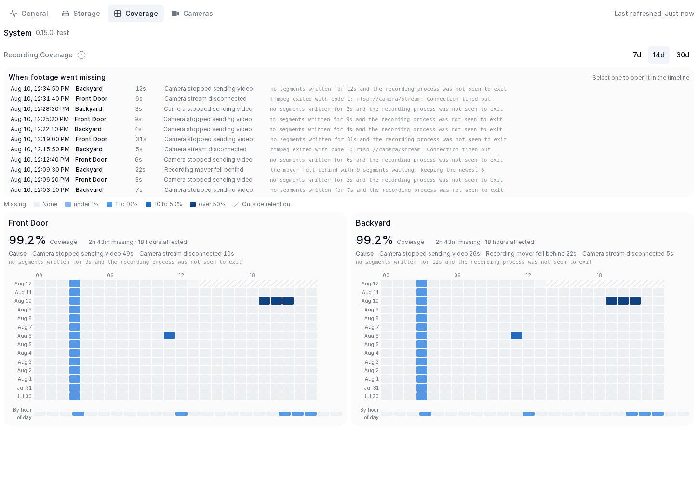
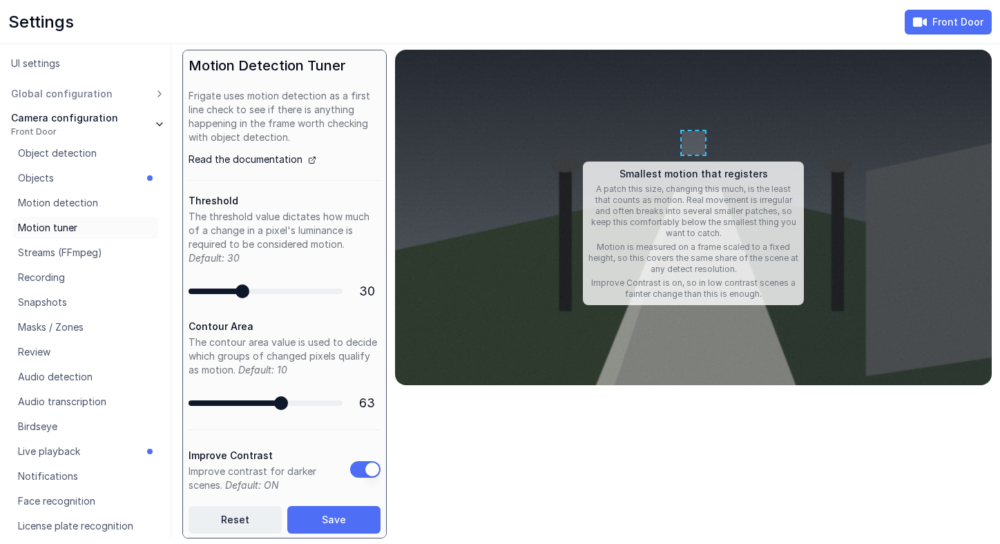

# Frigate NVR (fork)

A fork of [blakeblackshear/frigate](https://github.com/blakeblackshear/frigate).

## New features

### Recording coverage and gap causes

Frigate discards recording segments in several places, and a camera whose
stream goes down produces nothing to discard in the first place. The only trace
of any of it was a line in the log, so the usual way to find out that footage
was missing was to scrub onto the hole.

A **Coverage** tab under System reports it directly. Every cell is one hour of
one camera, shaded by how much of that hour is absent from the recordings
database, with an hour of day profile underneath for losses that repeat on a
schedule. A coverage percentage is reported only where continuous retention
makes one meaningful; event only cameras get a "when was footage kept" view
instead, because for them an empty hour is the normal case.

Every loss Frigate causes or observes is written to a `RecordingGaps` row that
names a cause, so a gap says why it happened rather than only that it did.

- **Losses are attributed, not just counted.** A mover backlog, a stalled
  detect stream, an invalid or corrupt segment, a failed remux, and storage
  pressure each book their own cause. Consecutive losses coalesce into one
  range, so an outage is a single row rather than one per segment.
- **Short dropouts are visible.** Absence is counted from the segment sequence
  rather than a two minute staleness timer, so a camera that drops its
  connection for well under a minute is recorded instead of vanishing.
  Boundaries come from each segment's real end rather than its configured
  length, since a stream copy only cuts on keyframes and the resulting
  overshoot would otherwise be reported as missing footage.
- **Every gap carries evidence.** A `detail` string holds what was observed at
  the time: the ffmpeg exit code and error behind a `stream_disconnected`, so
  `401 Unauthorized` and `Connection timed out` are different diagnoses; the
  backlog size behind a mover that fell behind; the probed duration behind a
  corrupt segment.
- **The suspect is named.** A recording process that exited is
  `stream_disconnected`, one that stayed up producing nothing is
  `stream_stalled`, and Frigate itself being down is `frigate_restart`, so a
  host reboot is not blamed on every camera at once.
- **Losses are seekable.** One feed lists every loss across every camera,
  newest first. Selecting one opens that camera's recording fifteen seconds
  before the footage stops, which is what turns a reported gap into a verified
  one.

[Documentation](docs/docs/fork/recording_coverage.md)

### Motion tuner threshold preview

Draws a patch over the camera image while a motion slider is held, sized by
`contour_area` and strobing by `threshold`, so both can be judged against the
scene instead of computed by hand. Neither value is in units the image shows:
contour area is measured on the downscaled motion frame, and threshold is a
luma delta against the running background.

## Minor improvements

- **Region grid clear coverage.** Tests for upstream's fix that keeps a cleared
  region grid cleared across a rebuild, which upstream shipped without any.
- **Devcontainer bytecode.** Sets `PYTHONDONTWRITEBYTECODE` on the devcontainer
  service so the container stops writing root owned `__pycache__` into the bind
  mounted working tree, where it cannot be cleaned up without `sudo`.

## Developed on branches, not merged here

- **Detection region budget**
  ([`region-budget`](https://github.com/johnchia/frigate/tree/region-budget)).
  Bounds how many object detection regions each camera may run per second, and
  spends whatever capacity it has on the most valuable regions first, so that a
  camera in a motion storm degrades on its own instead of slowing down every
  other camera. Regions covering already tracked objects are always prioritized
  over new motion, so what degrades under pressure is how quickly new objects
  are discovered rather than how reliably existing ones are followed. Disabled
  by default, and reports what it would have done while off.
  [Documentation](https://github.com/johnchia/frigate/blob/region-budget/docs/docs/frigate/region_budget.md).

---

Screenshots are taken against sample data on a test instance, not a live
system.
